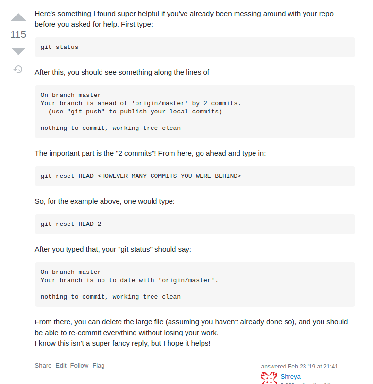

# 1. Các lệnh cơ bản trong Git

|Chức năng|Lệnh|Ghi chú|
|-|-|-|
|Tạo nhánh mới và chuyển nhánh|`git checkout -b <branch name>`||
|Tạo nhánh mới nhưng ko chuyển nhánh|`git branch <branch name>`||
|Chuyển sang một nhánh nào đó|`git checkout <branch name>`||
|Đẩy nhánh mới lên host|`git push origin <branch name>`||
|Liệt kê các nhánh đang có|`git branch -a` hoặc `git branch`|Nhấn `q` để thoát|
|Xem lịch sử commit|`git log`|Nhấn `q` để thoát|
|Xem lịch sử commit (bản tóm tắt)|`git log --oneline`|Nhấn `q` để thoát|
|Xem lịch sử `n` commit cuối cùng|`git log -<n>`|Nhấn `q` để thoát|
|Đặt nhánh hiện tại làm default|`git branch --set-upstream-to origin/<branch name>`||

# Hướng dẫn làm README.md github profile 
* Clip hướng dẫn: [https://youtu.be/ECuqb5Tv9qI](https://youtu.be/ECuqb5Tv9qI)

# Sửa lỗi đẩy file lớn lên git
