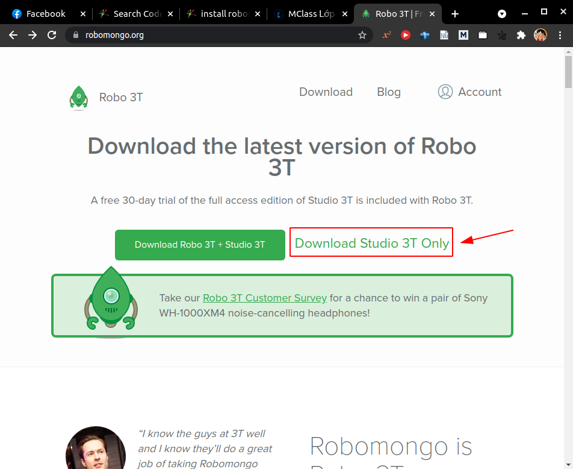
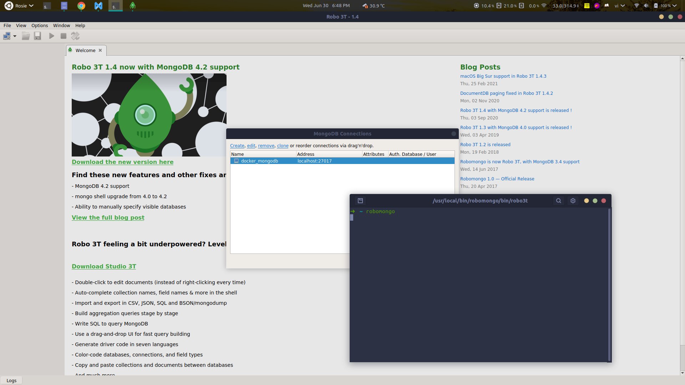

* Trước tiên cần download file cài đặt robomongo về, lưu ý tải bản **Studio 3T Only**:
  

* Mở terminal tại folder chứa file cài đặt robomongo, giả sử là thư mục `Downloads`, ghõ các lệnh:
  ```
  tar -xvzf robo3t-1.1.1-linux-x86_64-c93c6b0.tar.gz
  sudo mkdir /usr/local/bin/robomongo
  sudo mv  robo3t-1.1.1-linux-x86_64-c93c6b0/* /usr/local/bin/robomongo
  cd /usr/local/bin/robomongo/bin
  sudo chmod +x robo3t 
  sudo gedit ~/.zshrc
  ```

* Thêm dòng dưới đây vào `.zshrc`, sau đó lưu lại
  ```
  alias robomongo='/usr/local/bin/robomongo/bin/robo3t'
  ```

* Update lại file `.zshrc`:
  ```
  source ~/.zshrc
  ```

* Từ nay để chạy robomongo, mở terminal và ghõ lệnh:
  ```
  robomongo
  ```
  