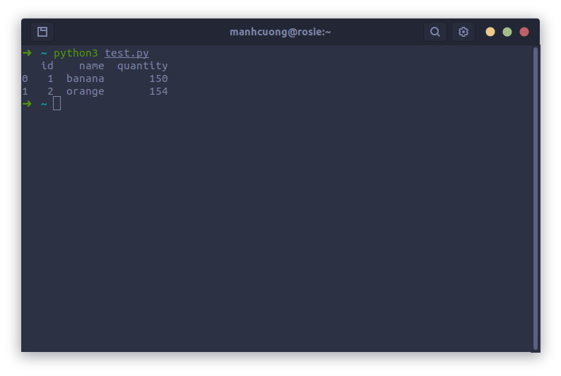

# 1. Phần mềm convert định dạng ảnh
* Cài đặt: `sudo apt-get install imagemagick`

|Lệnh|Giải thích|
|-|-|
|`convert <image_1>.jpg <image_2>.png`| chuyển `image_1` sang file `*.png`|
|`convert -resize 20% source.png dest.png`|scale image theo tỉ lệ |
|`mogrify -format png *.jpg`| chuyển tất cả file `*.jpg` sang `*.png`|

# 2. Các lỗi trong quá trình cài Ubuntu
* Lỗi RST khi cài đặt: [https://youtu.be/rSn34Gv3-D4](https://youtu.be/rSn34Gv3-D4)
# 4. Sử dụng `pimg` để lưu hình chụp màn hình từ clipboard
* Trước tiên cần install, ghõ lệnh
```
pip3 install pimg
```
* Sau khi chụp màn hình và lưu vào clipboard, có thể dùng lệnh dưới đây để lưu hình, giả sử cần lưu hình vào đường dẫn `~/Downloads/image.png` thì làm như sau:
```
pimg ~/Downloads/image.png
```

* Alias
```shell
# save image
function si() {
  name="$1"
  pimg g "${name}.png"
}
```

# 5. Cài đặt MS-SQL lên docker container và kết nối đến CSDL bằng Python
* **Bước 1**: 
  * Pull image MS-SQL về
  ```
  sudo docker pull mcr.microsoft.com/mssql/server:2019-latest
  ```

* **Bước 2**: 
  * Chạy container từ image MS-SQL
  ```
  sudo docker run -e "ACCEPT_EULA=Y" -e "SA_PASSWORD=Cuong*0902902209" \
   -p 1433:1433 --name sql1 -h sql1 \
   -d mcr.microsoft.com/mssql/server:2019-latest
  ```
  * Tại đây:
    * `"SA_PASSWORD=Cuong*0902902209"`: là password của hê quản trị CSDL, giá trị là `Cuong*0902902209`.
    * `--name sql1`: tên của container
    * Những thứ khác đọc thêm [tại đây](https://docs.microsoft.com/en-us/sql/linux/quickstart-install-connect-docker?view=sql-server-ver15&pivots=cs1-bash)
    * **LƯU Ý**: <mark>phải đặt password cho thật mạnh, vừa chữ vừa số in hoa kí tự đặc biệt các kiểu dài trên 13 kí tự nếu ko là mấy bước sau setup cực kì mệt.</mark>

* **Bước 3**:
  * Ghõ lệnh `docker ps -a` xem **STATUS** của container `sql1` là `Up` chưa, nếu `Exit` thì xóa cái container `sql1` đi, build cái container khác và setup password mạnh lên.

* **Bước 4**:
  * Kết nối đến MS-SQL:
  ```
  docker exec -it sql1 "bash"
  /opt/mssql-tools/bin/sqlcmd -S localhost -U SA -P "Cuong*0902902209"
  ```

  * Tạo database thử nghiệm:
    ```sql
    CREATE DATABASE TestDB
    SELECT Name from sys.Databases
    GO
    ```
    * Ở đây nếu hiện lên mấy cái database có sẵn mà có cái database tên là `TestDB` thì thành công.
  
  * Insert data vào TestDB:
    ```sql
    USE TestDB
    CREATE TABLE Inventory (id INT, name NVARCHAR(50), quantity INT)
    INSERT INTO Inventory VALUES (1, 'banana', 150); INSERT INTO Inventory VALUES (2, 'orange', 154);
    GO
    ```
  
  * Load dữ liệu vừa insert:
    ```sql
    SELECT * FROM Inventory WHERE quantity > 152;
    GO
    ```
    * Tại đây, nếu ra một dòng vừa insert vào có `quantity > 152` thì thành công.

* **Bước 5**:
  * Ghõ lệnh:
  ```
  sudo apt-get install unixodbc libodbc1 unixodbc-dev
  ```

  ```
  pip3 install pyodbc
  ```

  ```
  sudo apt-get update
  sudo apt-get upgrade
  
  sudo su
  curl https://packages.microsoft.com/keys/microsoft.asc | apt-key add -
  curl https://packages.microsoft.com/config/ubuntu/20.04/prod.list > /etc/apt/sources.list.d/mssql-release.list

  exit
  sudo apt-get update
  sudo apt-get upgrade
  sudo ACCEPT_EULA=Y apt-get install -y msodbcsql17

  sudo ACCEPT_EULA=Y apt-get install -y mssql-tools
  echo 'export PATH="$PATH:/opt/mssql-tools/bin"' >> ~/.zshrc
  source ~/.zshrc
  ```

* **Bước 6**:
  * Tạo file `*.py` có tên là `test.py`
  ```python
  import pyodbc
  import pandas as pd

  con = pyodbc.connect('DRIVER={};SERVER={};PORT:{};DATABASE={};UID={};PWD={}'.format(
      "ODBC Driver 17 for SQL Server",
      "localhost",
      1433,
      "TestDB",
      "sa",
      "Cuong*0902902209"
  ))
  con.execute("USE TestDB")

  df=pd.read_sql('SELECT * FROM Inventory', con)

  print(df)
  ```

  * Ghõ lệnh `python3 test.py` mà ra như vầy thi okla
  

# 6. Alias cho chuổi lệnh github
* Mở file `.zshrc` lên và bỏ vào dòng này:
  ```shell
    function gs () {
    # cmm=${1:-"This is my commit"}
    cmm="$1"
    if test -z "$cmm"
    then
        cmm="This is Manh Cuong's commit 🌻."
    fi
    
    git add . && git commit -m "$cmm" && git push
    }
  ```
* Sau đó save lại và mở terminal ghõ lệnh:
  ```shell
  source ~/.zshrc
  ```

* Từ này thay vì sài combo lệnh:
  ```shell
  git add .
  git commit -m "đây là một commit"
  git push
  ```
  thì có thể nhẹ nhàng hơn bằng lệnh này:
  ```shell
  gitdone "đây là một commit"
  ```

# 7. Cài đặt Fake Ip
* Ghõ lệnh:
  ```shell
  sudo apt-get install tor
  sudo apt-get install privoxy
  ```

* Tạo thư mục `aut`:
  ```shell
  cd ~/usr/share/
  sudo mkdir aut
  ```

* Clone repo này về [https://github.com/FDX100/Auto_Tor_IP_changer](https://github.com/FDX100/Auto_Tor_IP_changer) và ghõ lệnh
  ```shell
  cd ~
  cd Auto_Tor_IP_changer
  sudo python3 install.py
  ```

* Từ nay về sau, chỉ cần mở terminal lên ghõ lệnh `sudo aut` là chạy.

# 8. Phần mềm quay màn hình tạo ảnh gif Peek
  ```shell
  sudo apt update
  sudo apt install peek
  ```
# 9. Install Flameshot
* [https://flameshot.org](https://flameshot.org/)

# 10. Alias kleantrans
* Install translate-shell
```bash
sudo apt-get update -y
sudo apt-get install -y translate-shell
```

* Install X-Clip
```bash
sudo apt-get install xclip
```
* Install tkinter
```bash
sudo apt-get install python3-tk
```
* Install python packages
```bash
pip3 install pyperclip==1.8.2
pip3 install PySide2==5.15.2.1
pip3 install pynput==1.7.4
```
* Alias command
```shell
# run kleantrans
function kleantrans() {
  cd /usr/cuongdm/kleantrans/
  nohup python3 main.py &>/dev/null &
}
```
# 11. Install some gnome extensions
```bash
sudo apt install gnome-shell-extensions -y
sudo apt install gnome-tweaks -y
```
* [https://extensions.gnome.org/extension/19/user-themes](https://extensions.gnome.org/extension/19/user-themes/)
* [https://extensions.gnome.org/extension/779/clipboard-indicator](https://extensions.gnome.org/extension/779/clipboard-indicator/)
* [https://extensions.gnome.org/extension/906/sound-output-device-chooser](https://extensions.gnome.org/extension/906/sound-output-device-chooser/)
* [https://extensions.gnome.org/extension/1401/bluetooth-quick-connect](https://extensions.gnome.org/extension/1401/bluetooth-quick-connect/)
* [https://extensions.gnome.org/extension/2182/noannoyance](https://extensions.gnome.org/extension/2182/noannoyance/)

# 12. Install Macos Touchpad
* [https://ubuntuhandbook.org/index.php/2022/06/touchpad-gestures-ubuntu-22-04-xorg](https://ubuntuhandbook.org/index.php/2022/06/touchpad-gestures-ubuntu-22-04-xorg/)

# 13. Alias for Anaconda in ZSHRC file
  ```bash
  # >>> conda initialize >>>
  # !! Contents within this block are managed by 'conda init' !!
  if [ -f "/home/cuongdm/anaconda3/etc/profile.d/conda.sh" ]; then
      . "/home/cuongdm/anaconda3/etc/profile.d/conda.sh"
  else
      export PATH="/home/cuongdm/anaconda3/bin:$PATH"
  fi
  # <<< conda initialize <<<
  ```

## 14. Cài đặt `ibus-unikey`
* Installa iBus-Unikey [https://minhng.info/tips/unikey-ubuntu-2204.html](https://minhng.info/tips/unikey-ubuntu-2204.html).
* Fix error can not type Vietnamese in VNI [click here](https://github.com/BambooEngine/ibus-bamboo/wiki/Kh%C3%B4ng-g%C3%B5-%C4%91%C6%B0%E1%BB%A3c-ti%E1%BA%BFng-vi%E1%BB%87t-tr%C3%AAn-ph%E1%BA%A7n-m%E1%BB%81m-%60abc-xyz%60#ki%E1%BB%83m-tra-bi%E1%BA%BFn-m%C3%B4i-tr%C6%B0%E1%BB%9Dng)

## 15. Install and config Git on Ubuntu
* [https://linuxhint.com/install-git-ubuntu22-04](https://linuxhint.com/install-git-ubuntu22-04/)

## 16. Elight extension for browser
* [https://drive.google.com/file/d/1xPW-0jYP7cu2E67fHi0dclsGmQdoHHOS/view?usp=sharing](https://drive.google.com/file/d/1xPW-0jYP7cu2E67fHi0dclsGmQdoHHOS/view?usp=sharing)

## 17. Setup Oh-My-ZSH
* [https://linuxhint.com/install-use-oh-my-zsh/](https://linuxhint.com/install-use-oh-my-zsh/)
* [https://gist.github.com/dogrocker/1efb8fd9427779c827058f873b94df95](https://gist.github.com/dogrocker/1efb8fd9427779c827058f873b94df95)

# 18. Install goldendict
* [https://www.howtoinstall.me/ubuntu/18-04/goldendict/](https://www.howtoinstall.me/ubuntu/18-04/goldendict/)

# 19. Install OBS studio
* [https://www.how2shout.com/linux/install-obs-studio-on-ubuntu-22-04-lts-jammy-linux/](https://www.how2shout.com/linux/install-obs-studio-on-ubuntu-22-04-lts-jammy-linux/)

# 20. Install Java
* [https://www.digitalocean.com/community/tutorials/how-to-install-java-with-apt-on-ubuntu-22-04](https://www.digitalocean.com/community/tutorials/how-to-install-java-with-apt-on-ubuntu-22-04)

# 21. Install theme and Icons
* [https://fostips.com/whitesur-theme-make-ubuntu-fedora-macos-big-sur](https://fostips.com/whitesur-theme-make-ubuntu-fedora-macos-big-sur/)
