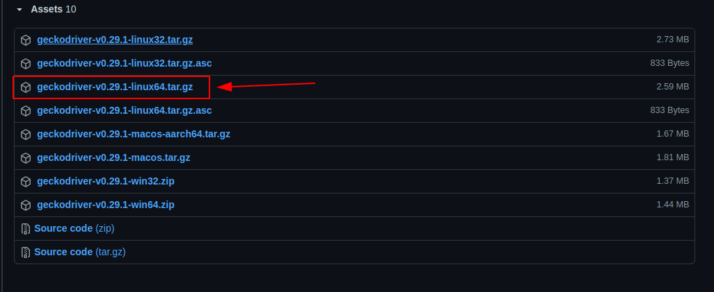

# 1. Cài đặt Selenium cho Python + Firefox
* **Bước 1**:
  * Ghõ lệnh:
    ```shell
    pip3 install selenium
    ```
* **Bước 2**:
  * Lên trang [https://github.com/mozilla/geckodriver/releases](https://github.com/mozilla/geckodriver/releases) để tải `geckodriver` phù hợp với hệ điều hành, sau đó giải nén.
    
* **Bước 3**:
  * Vào thư mục của geckodriver vừa giải nén, mở terminal ghõ lệnh:
    ```shell
    sudo mv geckodriver /usr/local/bin
    ```
* **Bước 4**:
  * Mở terminal và ghõ lệnh:
    ```shell
    export PATH=$PATH:/usr/local/bin/geckodriver
    ```

* **Bước 5**:
  * Chạy thử file `demo.py` dưới đây bằng terminal để kiểm tra, nếu Firefox tự động mở sau khi run code này thì cài đặt thành công:
    ###### demo.py
    ```python
    from selenium import webdriver

    browser = webdriver.Firefox()
    browser.get("http://www.ubuntu.com")
    ```

# 2. [Optional] Cài đặt PhantomJS 2.1.1
```shell
sudo apt-get update
sudo apt-get install build-essential chrpath libssl-dev libxft-dev -y
sudo apt-get install libfreetype6 libfreetype6-dev -y
sudo apt-get install libfontconfig1 libfontconfig1-dev -y
cd ~
export PHANTOM_JS="phantomjs-2.1.1-linux-x86_64"
wget https://github.com/Medium/phantomjs/releases/download/v2.1.1/$PHANTOM_JS.tar.bz2
sudo tar xvjf $PHANTOM_JS.tar.bz2
sudo mv $PHANTOM_JS /usr/local/share
sudo ln -sf /usr/local/share/$PHANTOM_JS/bin/phantomjs /usr/local/bin
phantomjs --version
```