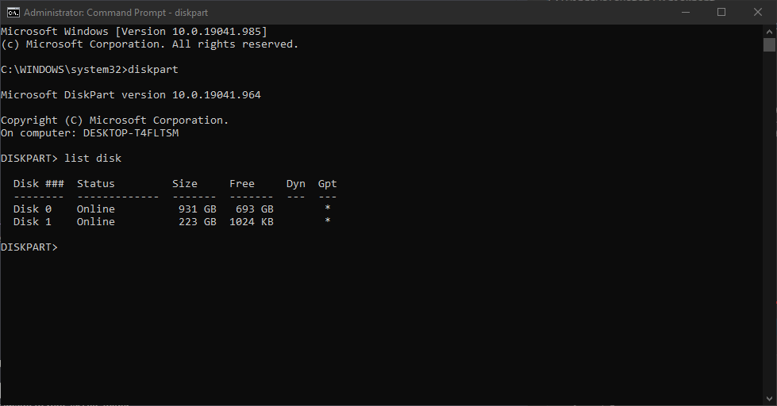
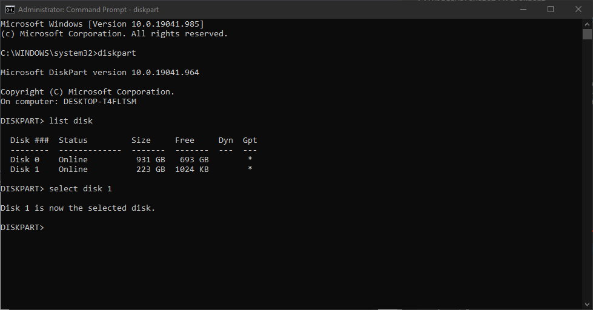
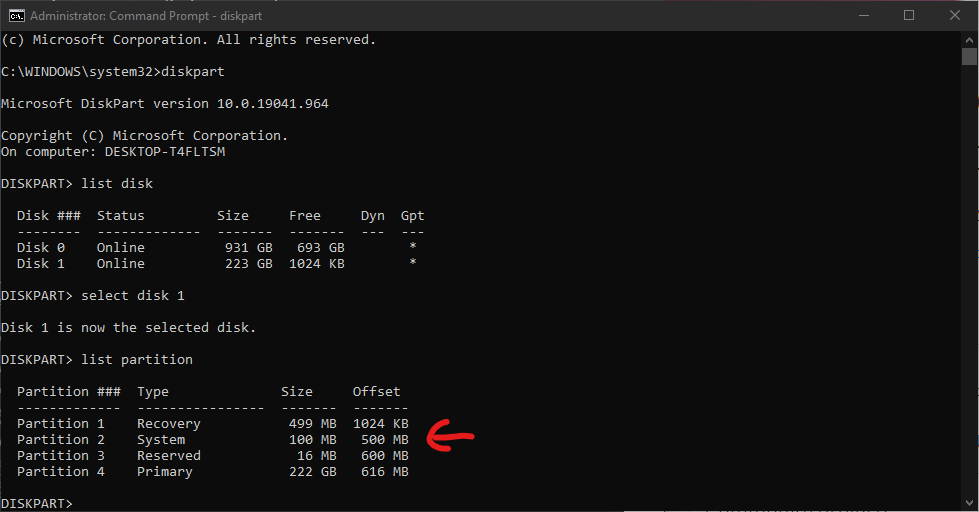
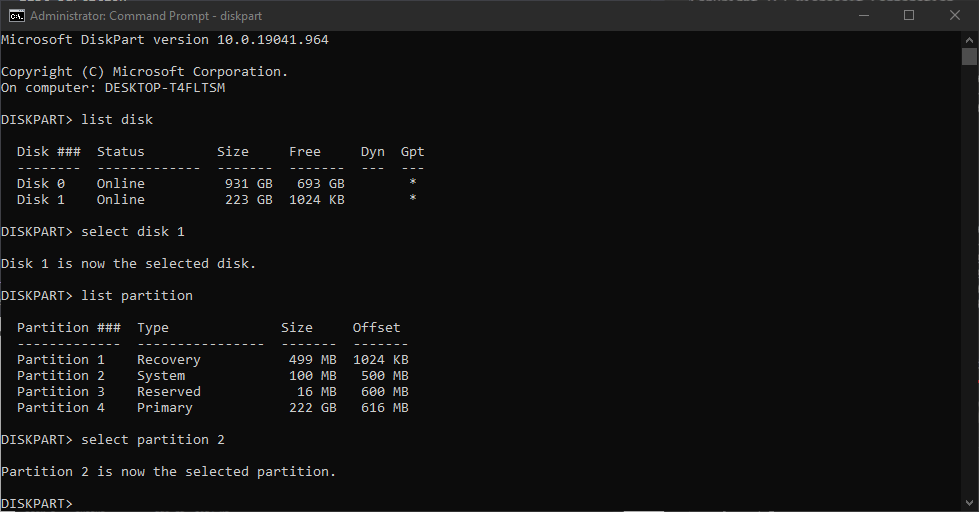
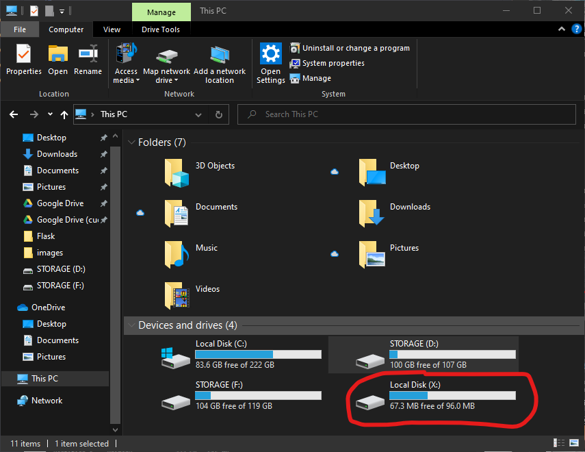
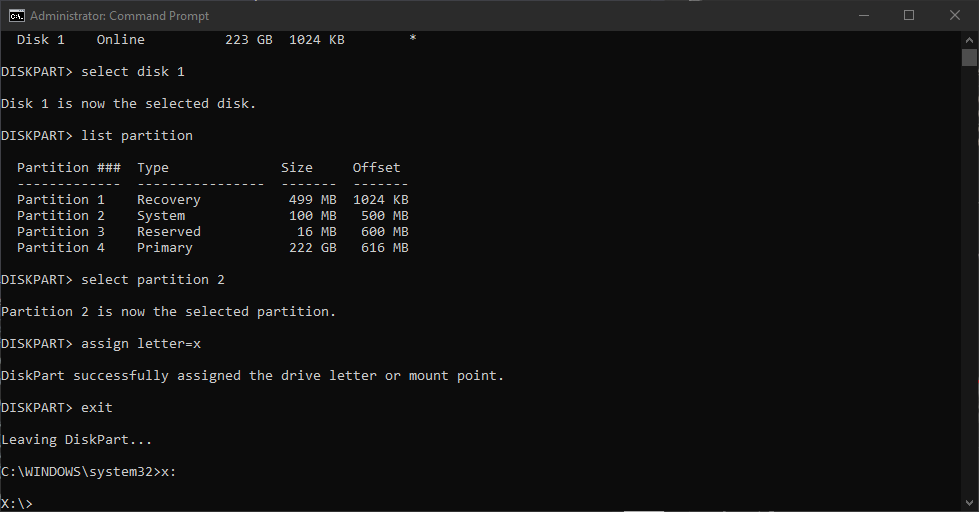
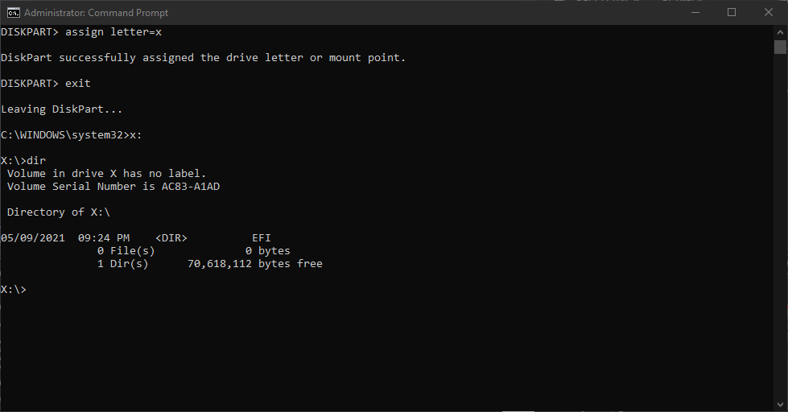
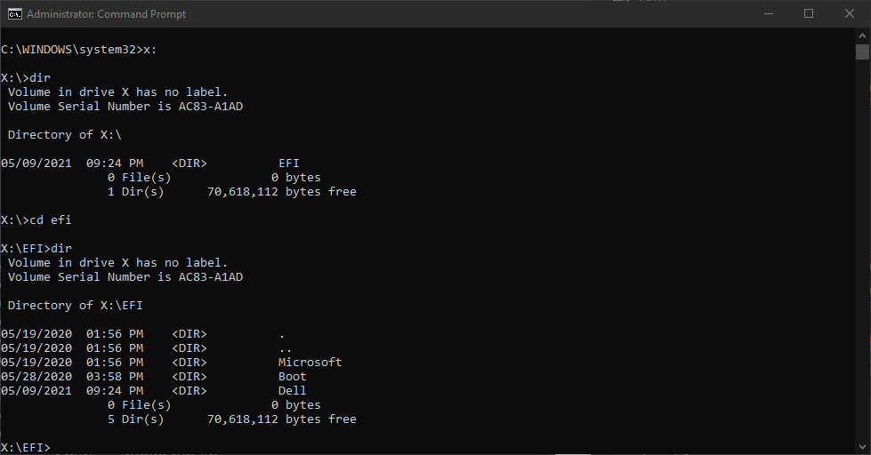

* Mở command prompt lên bằng quyền admin và ghõ từ khóa:
```
diskpart
```
* Sau đó ghõ lệnh:
```
list disk
```
  * Sẽ hiển thị ra danh sách các ổ đĩa có sẵn trên máy dưới đây, ở đây `Disk 0` có dụng lượng gần 1TB dùng để lưu trữ và `Disk 1` có dung lượng là 250GB dùng để cài đặt hệ điều hành.
  * Và vì ta đang cần xóa vùng nhớ boot Ubuntu đã cài trc đó nên ta sẽ chọn `Disk 1`.
  
    

* Chọn `Disk 1` bằng lệnh dưới đây:
```
select disk 1
```
  

* Liệt kê tất cả các partition có trên `Disk 1` bằng lệnh:
```
list partition
```
  * Tại đây, cần chú ý partition nào có **Type** là `System`, trên máy này là `Partition 2`.
    

* Chọn `Partition 2` bằng lệnh:
```
select partition 2
```
  

* Sau đó ghõ lệnh này:
```
assign letter=x
```
  

* Vào **This PC** sẽ thấy một ổ đĩa như thế này dc tạo ra:
  

* Quay lại command prompt, ghõ lệnh:
```
exit
```
  

* Truy cập vào ổ đĩa **X** bằng lệnh:
```
x:
```
  

* Liệt kê tất cả các file và folder có trong **X** bằng lệnh:
```
dir
```
  

* Tiếp tục ghõ lệnh dưới đây:
```
cd efi
dir
```
  
  
  * Tại đây nếu thấy một dir nào có tên là ubuntu thì thực thi tiếp bước dưới đây, ko thì dừng lại dc rồi.

* Nếu có tồn tại dir ubuntu thì thực hiện lệnh này:
```
rd ubuntu /s
exit
```

* Restart máy, hết...
